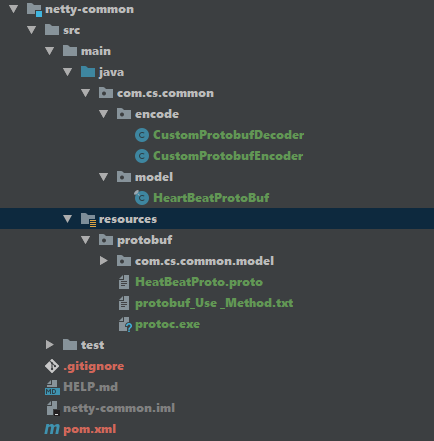
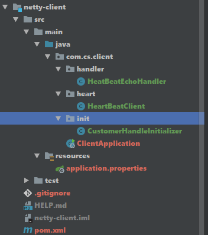
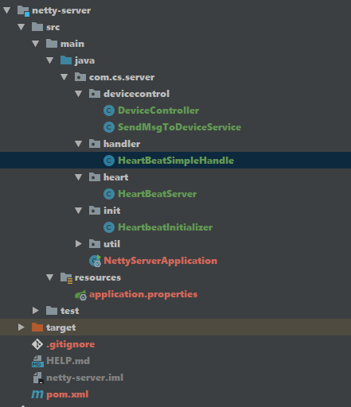
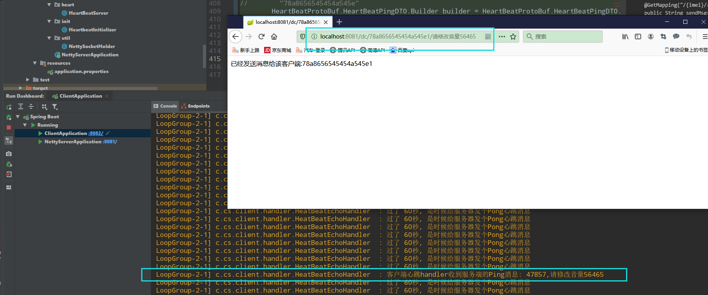

# springboot2.1.4+netty4.1.50.Final整合

#### 介绍
springboot整合netty的demo,并使用Google的protobuf作为心跳数据传输协议


#### IdleStateHandler 实现原理:

- Netty 可以使用 IdleStateHandler 来实现连接管理，当连接空闲时间太长（没有发送、接收消息）时则会触发一个事件，我们便可在该事件中实现心跳机制。

#### 父工程的pom文件介绍
```xml
<?xml version="1.0" encoding="UTF-8"?>
<project xmlns="http://maven.apache.org/POM/4.0.0"
         xmlns:xsi="http://www.w3.org/2001/XMLSchema-instance"
         xsi:schemaLocation="http://maven.apache.org/POM/4.0.0 http://maven.apache.org/xsd/maven-4.0.0.xsd">
    <modelVersion>4.0.0</modelVersion>
    <parent>
        <groupId>org.springframework.boot</groupId>
        <artifactId>spring-boot-starter-parent</artifactId>
        <version>2.1.4.RELEASE</version>
        <relativePath/> <!-- lookup parent from repository -->
    </parent>
    <groupId>com.cs.netty</groupId>
    <artifactId>springboot-netty</artifactId>
    <packaging>pom</packaging>
    <version>1.0-SNAPSHOT</version>
    <modules>
<!--        <module>netty-client</module>-->
<!--        <module>netty-server</module>-->
<!--        <module>netty-common</module>-->
    </modules>
    <properties>
        <junit.version>4.11</junit.version>
        <!--        <netty.version>4.1.21.Final</netty.version>-->
        <netty.version>4.1.50.Final</netty.version>
        <project.build.sourceEncoding>UTF-8</project.build.sourceEncoding>
        <project.reporting.outputEncoding>UTF-8</project.reporting.outputEncoding>
    </properties>

    <dependencies>
        <dependency>
            <groupId>io.netty</groupId>
            <artifactId>netty-all</artifactId>
            <version>${netty.version}</version>
        </dependency>

        <!-- https://mvnrepository.com/artifact/com.google.protobuf/protobuf-java -->
        <dependency>
            <groupId>com.google.protobuf</groupId>
            <artifactId>protobuf-java</artifactId>
            <version>3.12.0</version>
        </dependency>

        <dependency>
            <groupId>junit</groupId>
            <artifactId>junit</artifactId>
            <version>${junit.version}</version>
        </dependency>
    </dependencies>

    <build>
        <plugins>
            <plugin>
                <groupId>org.apache.maven.plugins</groupId>
                <artifactId>maven-compiler-plugin</artifactId>
                <version>2.3.2</version>
                <configuration>
                    <source>1.8</source>
                    <target>1.8</target>
                </configuration>
            </plugin>
        </plugins>
    </build>
</project>
```


#### 安装教程

1.  编写common工程,主要共用的pojo,已经protobuf文件等等.
2.  编写client工程
3.  编写client工程

#### common工程

1. 在pom.xml文件继承父工程,然后在resources目录下存放protobuf.exe, 还有心跳类的定义文件HeatBeatProto.proto,

2. 开始使用proto.exe文件生成对应的java类,并copy到model目录下

3. 因为我们这次demo有2个protobuf文件协议, 如果[在socket上传输多种类型的protobuf数据](https://www.cnblogs.com/Binhua-Liu/p/5577622.html),需要实现自己的编码器和解码器, 不然只能传输一种类型的protobuf数据(测试过), 我比较懒, 所以复制的都是上面的两个文件到自己的工程下, 然后修改一些proto对象转换的几句代码, 在文件最下面可以看到

4. 最后的工程目录截图

   

   

#### client工程

1. 在pom.xml文件继承父工程,

2. 1初始化一个initChannel,设置编码器(前面提到的), 设置心跳事件, 以及handler


   ,客户端handler()方法与服务端childHandler()同样都是需要一个ChannelInitializer类,ChannelInitializer是一个特殊的处理程序,这里用CustomerHandleInitializer继承了ChannelInitializer

   ```java
   public class CustomerHandleInitializer extends ChannelInitializer<Channel> {
       @Override
       protected void initChannel(Channel channel) throws Exception {
           channel.pipeline()
                   //10 秒没发送消息 将IdleStateHandler 添加到 ChannelPipeline 中
                   // .addLast(new IdleStateHandler(0, 10, 0))
                   // .addLast(new EchoClientHandle());
   /**
                   // 用protobuf做心跳试试,如果使用这方法的话, 只能传输一种格式的protobuf,多种格式需要自定义的protobuf解码器
   //                .addLast(new IdleStateHandler(0, 10, 0))
                   .addLast(new ProtobufVarint32FrameDecoder())
                   .addLast(new ProtobufDecoder(DeviceControlProtoBuf.HeartBeatDTO.getDefaultInstance()))
                   .addLast(new ProtobufDecoder(DeviceControlProtoBuf.PingDTO.getDefaultInstance()))
                   .addLast(new ProtobufVarint32LengthFieldPrepender())
                   .addLast(new ProtobufEncoder())
                   .addLast(new HeatBeatEchoHandlerProtoBuf())
    **/
                   //      自定义protobuf解码器, 能解析多种protobuf格式 用法来着 https://www.cnblogs.com/Binhua-Liu/p/5577622.html
                   // 第二个参数60是指, 客户端60秒内(writeIdleTimeSeconds)没有给服务端发送消息的话, 会触发这个IdleStateEvent事件, 是时候给服务端发消息说一声:"我还活着", 或者发送个状态信息什么的
                   // 如果是服务端的话,应该设置第一个参数是60(readIdleTimeSeconds),即60秒没有读到信息来自客户端的信息就触发IdleStateEvent事件, 给客户端发送消息"你还活着吗??"
                   .addLast(new IdleStateHandler(0, 60, 0))
                   .addLast("decoder", new CustomProtobufDecoder())
                   .addLast("encoder", new CustomProtobufEncoder())
                   .addLast(new HeatBeatEchoHandler())
           ;
       }
   }
   ```

   

   2.2 handler类, 做两件事 第一: 专门监听触发的IdleStateEvent, 然后给服务端发送心跳&状态信息 第二:接受服务端发过来的Ping信息 在方法**channelRead0()**

   

   SimpleChannelInboundHandler继承了 ChannelInboundHandlerAdapter 的一个扩展(SimpleChannelInboundHandler),
   而ChannelInboundHandlerAdapter是ChannelInboundHandler的一个实现
   ChannelInboundHandler提供了可以重写的各种事件处理程序方法,包括channelRead0()方法.
   目前，只需继承 SimpleChannelInboundHandler或ChannelInboundHandlerAdapter 而不是自己实现处理程序接口。
   我们重写了channelRead0()方法,每当接收到新数据时，都会使用收到的消息调用此方法, 也可以写不同的类来接受不同的数据类型

   ```java
       public class HeatBeatEchoHandler extends SimpleChannelInboundHandler<HeartBeatProtoBuf.HeartBeatPingDTO> {
   
       private final static Logger LOGGER = LoggerFactory.getLogger(HeatBeatEchoHandler.class);
   
       @Override
       public void userEventTriggered(ChannelHandlerContext ctx, Object evt) throws Exception {
           if (evt instanceof IdleStateEvent) {
               IdleStateEvent idleStateEvent = (IdleStateEvent) evt;
               if (idleStateEvent.state() == IdleState.WRITER_IDLE) {
                   // 客户端60秒内(writeIdleTimeSeconds)没有给服务端发送消息的话, 会触发这个IdleStateEvent事件, 是时候给服务端发消息说一声:"我还活着", 或者发送个状态信息什么的
                   LOGGER.info("过了 60秒, 是时候给服务器发个Pong心跳消息");
                   // 向服务端发送消息
                   HeartBeatProtoBuf.HeartBeatPongDTO.Builder heatBeatBuilder = HeartBeatProtoBuf.HeartBeatPongDTO.newBuilder();
                   // 设置设备ip,
                   heatBeatBuilder.setDeviceIp("113.65.205.93");
                   // 摄像头运行状态 0：异常 1：正常'
                   heatBeatBuilder.setCameraWorkStatus(1);
                   // HEART_BEAT(3,"心跳检测"),
                   heatBeatBuilder.setMsgType(3);
                   // 分辨率
                   heatBeatBuilder.setDeviceResolution("1920*1080");
                   // imei
                   heatBeatBuilder.setImei("78a8656545454a545e1");
                   // 设置是否背光（0：否 1：是）
                   heatBeatBuilder.setIsBlacklight(0);
                   // 屏幕亮度 默认20
                   heatBeatBuilder.setScreenBrightness("60");
                   // 是否开机自启（0：否 1：是）
                   heatBeatBuilder.setIsRootStart(1);
                   // 是否开启进程守护（0 否 1：是）
                   heatBeatBuilder.setIsGuard(1);
                   // 是否显示状态栏（0：否 1：是）
                   heatBeatBuilder.setIsStatus(1);
                   // 设置监听器,关闭连接? TODO
                   ctx.writeAndFlush(heatBeatBuilder.build()).addListener(ChannelFutureListener.CLOSE_ON_FAILURE);
               }
   
           }
           super.userEventTriggered(ctx, evt);
       }
   
       /**
        *  每当从服务端接收到新数据时，都会使用收到的消息调用此方法 channelRead0(),在此示例中，接收消息的类型是ByteBuf。
        * @param channelHandlerContext
        * @param byteBuf
        * @throws Exception
        */
       @Override
       protected void channelRead0(ChannelHandlerContext channelHandlerContext, HeartBeatProtoBuf.HeartBeatPingDTO byteBuf) throws Exception {
           //从服务端收到消息时被调用
           // LOGGER.info("客户端心跳handler收到消息={}", byteBuf.toString());
           LOGGER.info("客户端心跳handler收到服务端的Ping消息: {},{}", byteBuf.getId(),byteBuf.getContent());
       }
   
       @Override
       public void exceptionCaught(ChannelHandlerContext ctx, Throwable cause)
               throws Exception {
           ctx.fireExceptionCaught(cause);
           LOGGER.error("client catcher Exception: {}", cause.getMessage());
       }
   
       
   }
   ```

   

3. Spring 管理 netty client端配置 , 将2.1设置的initChannel, 设置为netty的

   说白了跟Spring进行集成就是将自己变成一个Bean交给Spring...(个人看法)

   

   Netty中服务器和客户端之间最大和唯一的区别是使用了不同的Bootstrap和Channel实现。
   (1),如果只指定一个EventLoopGroup，它将同时用作boss组和worker组。 但是，老板工作者不会用于客户端。
   (2),Bootstrap(客户端使用)类似于ServerBootstrap(服务端使用)，不同之处在于它适用于非服务器通道
   (3),NioSocketChannel用于创建客户端通道，而不是NioServerSocketChannel(服务端)

   ```java
   /**
    * @PostConstruct 注解; 在bean初始化的时候回执行这方法
    * @throws InterruptedException
    */
   @PostConstruct
   public void start() throws InterruptedException {
       Bootstrap bootstrap = new Bootstrap();
       /**
        * NioSocketChannel用于创建客户端通道，而不是NioServerSocketChannel。
        * 请注意，我们不像在ServerBootstrap中那样使用childOption()，因为客户端SocketChannel没有父服务器。
        */
       bootstrap.group(group).channel(NioSocketChannel.class).handler(new CustomerHandleInitializer());
       /**
        * 启动客户端
        * 我们应该调用connect()方法而不是bind()方法。
        */
       ChannelFuture future = bootstrap.connect(host, nettyPort).sync();
       if (future.isSuccess()) {
           LOGGER.info("启动 client Netty 成功");
       }
       socketChannel = (SocketChannel) future.channel();
   }
   /**
    * 销毁
    */
   @PreDestroy
   public void destroy() {
       group.shutdownGracefully().syncUninterruptibly();
       LOGGER.info("关闭 client Netty 成功");
   }
   ```

   

   最后的目录结构如下:

   


#### server工程

1.  在pom.xml文件继承父工程,
2.  1初始化一个initChannel,设置编码器(前面提到的), 设置心跳事件(这个可有可无,心跳都是客户端发过来的), 以及handler, 和client端差不多
3.  handler 主要处理客户端发送的心跳信息,以及使用ConcurrentHashMap保存连接的客户端,所以每当有个连接上来的时候，我们都将当前的 Channel 与连上的客户端 ID 进行关联（因此每个连上的客户端 ID 都必须唯一）。
    这里采用了一个 Map(**NettySocketHolder**) 来保存这个关系，并且在断开连接时自动取消这个关联。**后面的主动给某id的设备发送消息也靠这个**

```java
    /**
     * 取消绑定
     * @param ctx
     * @throws Exception
     */
    @Override
    public void channelInactive(ChannelHandlerContext ctx) throws Exception {
        NettySocketHolder.remove((NioSocketChannel) ctx.channel());
        LOGGER.error("移除设备:{}", ctx.channel().id());
    }

    @Override
    public void userEventTriggered(ChannelHandlerContext ctx, Object evt) throws Exception {
        if (evt instanceof IdleStateEvent) {
            IdleStateEvent idleStateEvent = (IdleStateEvent) evt;
            if (idleStateEvent.state() == IdleState.READER_IDLE) {
//                LOGGER.info("已经5秒没有收到信息！给客户端发个信息线");
                //向客户端发送消息 ,并且添加一个监听器, 如果ta关闭了则服务端也关闭对其监听,并在设备在线列表移除
//                ctx.writeAndFlush(HEART_BEAT).addListener(ChannelFutureListener.CLOSE_ON_FAILURE);
                LOGGER.info("触发idleStateEvent");
            }
        }
        super.userEventTriggered(ctx, evt);
    }

    @Override
    protected void channelRead0(ChannelHandlerContext ctx, HeartBeatProtoBuf.HeartBeatPongDTO heartBeat) throws Exception {
        LOGGER.info("收到心跳信息:{}", heartBeat.toString());
        //我们调用writeAndFlush（Object）来逐字写入接收到的消息并刷新线路
        //ctx.writeAndFlush(customProtocol);
        //保存客户端与 Channel 之间的关系
         NettySocketHolder.put(heartBeat.getImei(), (NioSocketChannel) ctx.channel());
    }
```

4.交给Spring管理 和上面client端差不多设置

```java
@Component
public class HeartBeatServer {

    private final static Logger LOGGER = LoggerFactory.getLogger(HeartBeatServer.class);
    /**
     * NioEventLoopGroup是一个处理I / O操作的多线程事件循环。 Netty为不同类型的传输提供各种EventLoopGroup实现。
     * 我们在此示例中实现了服务器端应用程序，因此将使用两个NioEventLoopGroup。第一个，通常称为“老板”，接受传入连接。第二个，通常称为“工人”，
     * 一旦老板接受连接并将接受的连接注册到工作人员，就处理被接受连接的流量。使用了多少个线程以及它们如何映射到创建的Channels取决于EventLoopGroup实现，甚至可以通过构造函数进行配置。
     */
    private EventLoopGroup boss = new NioEventLoopGroup();
    private EventLoopGroup work = new NioEventLoopGroup();

    @Value("${netty.server.port}")
    private int nettyPort;

    /**
     * 启动 Netty
     *
     * @return
     * @throws InterruptedException
     */
    @PostConstruct
    public void start() throws InterruptedException {
        ServerBootstrap bootstrap = new ServerBootstrap()
                .group(boss, work)
                .channel(NioServerSocketChannel.class)
                .localAddress(new InetSocketAddress(nettyPort))
                //保持长连接
                .childOption(ChannelOption.SO_KEEPALIVE, true)
                .childHandler(new HeartbeatInitializer())
//                .childHandler(new HeartbeatInitializer())
                ;
        //绑定并开始接受传入的连接。
        ChannelFuture future = bootstrap.bind().sync();
        if (future.isSuccess()) {
            LOGGER.info("启动 Netty 成功");
        }
    }

    /**
     * 销毁
     */
    @PreDestroy
    public void destroy() {
        boss.shutdownGracefully().syncUninterruptibly();
        work.shutdownGracefully().syncUninterruptibly();
        LOGGER.info("关闭 Netty 成功");
    }
}
```

目录结构如下:



#### 给指定的客户端发送消息

刚刚已经使用一个NettySocketHolder保存在线的设备, 设备的IMEI作为Map的key

现在编写一个Service给指定设备发送消息(根据IMEI给设备发)

```java
    public String sendMsg(String deviceImei, HeartBeatProtoBuf.HeartBeatPingDTO controlDTO) {

        Map<String, NioSocketChannel> map = NettySocketHolder.getMAP();
        NioSocketChannel nioSocketChannel = map.get(deviceImei);
        if (Objects.nonNull(nioSocketChannel)) {
            nioSocketChannel.writeAndFlush(controlDTO);
            return String.format("已经发送消息给该客户端:%s", deviceImei);
        } else {
            return ("该设备离线, sorry");
        }
    }
```


HTTP接口

```java
@RestController
@RequestMapping("/dc")
public class DeviceController {
    private final static Logger LOGGER = LoggerFactory.getLogger(DeviceController.class);

    @Autowired
    private SendMsgToDeviceService sendMsgToDeviceService;

    @GetMapping("/{imei}/{content}")
    public String sendMsg(@PathVariable("imei") String imei, @PathVariable("content") String content) {
//        "78a8656545454a545e"
        HeartBeatProtoBuf.HeartBeatPingDTO.Builder builder = HeartBeatProtoBuf.HeartBeatPingDTO.newBuilder();
        builder.setContent(content);
        builder.setId(new Random().nextInt(60_000));
        return sendMsgToDeviceService.sendMsg(imei,builder.build());
    }
}
```

最后在网页端发送给客户端(```IMEI:78a8656545454a545e```)发送消息


